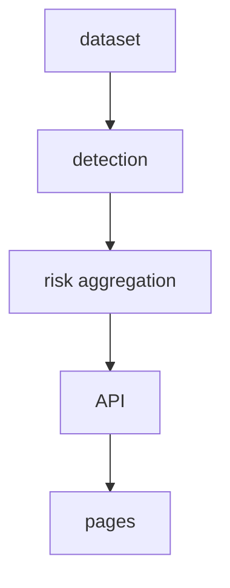

Every MPLADS work has a record. PRAHARI cross-checks those records against each other — and every flag it raises carries evidence.

## Quickstart

```bash
git clone <repository-url>
make demo
```
URL: http://localhost:3000

## Architecture



## Validation (measured on the labeled dataset)

```json
{
  "system_precision": 0.3325242718446602,
  "innocent_fp": 0.275609756097561,
  "macro_f1": 0,
  "alert_budget": 1.3205128205128205,
  "confusion": {
    "flagged": {
      "anomaly-labeled": 274,
      "innocent-labeled": 211,
      "unlabeled": 339
    },
    "unflagged": {
      "anomaly-labeled": 135,
      "innocent-labeled": 360,
      "unlabeled": 1100
    }
  },
  "counts": {
    "total_works": 2419,
    "flagged_works": 824
  }
}
```

## Honest Limitations

D1's `is_p2` logic currently requires the literal `(Phase 2)` suffix to be present in the text to identify P2 clones. This is recipe-matching against the synthetic data generator, not general duplication detection. Real-data transfer and judge Q&A must account for it. 

Step 14 candidate: drop this crutch and lean on corroboration (distance, same agency, similar cost) instead of relying on exact string suffixes.

## Roadmap

Phase 2: citizen ground-truth layer, historical audit validation, cost-norm benchmarking.
